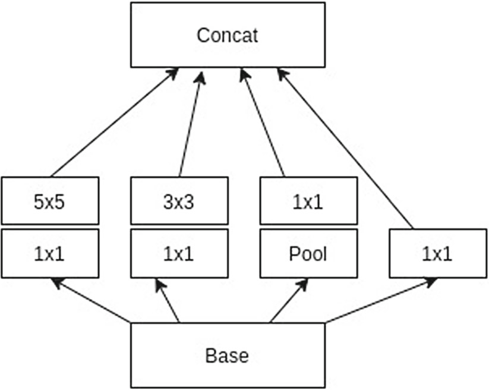
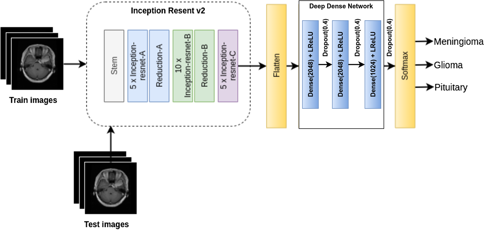
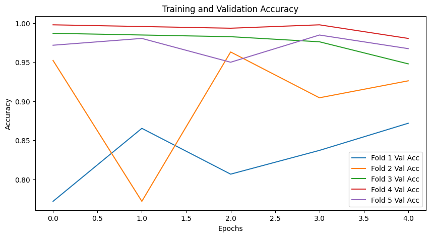
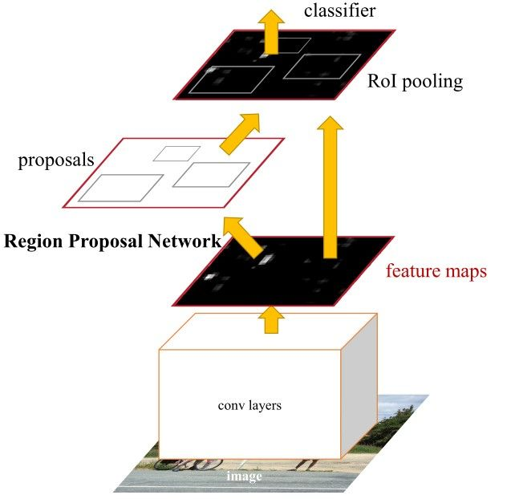
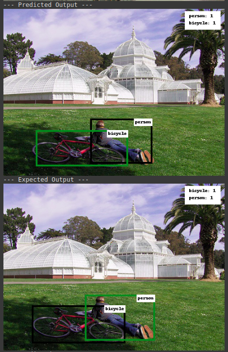

# Neural Networks & Deep Learning - Computer Assignment #3 - Fall 2022
## University of Tehran
### Transfer Learning, 

* Q1: Inception (Three-class brain tumor classification using deep dense inception residual network)

* Q2: Faster R-CNN: Towards Real-Time Object Detection with Region Proposal Networks

